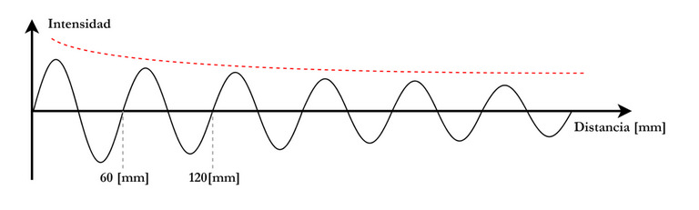
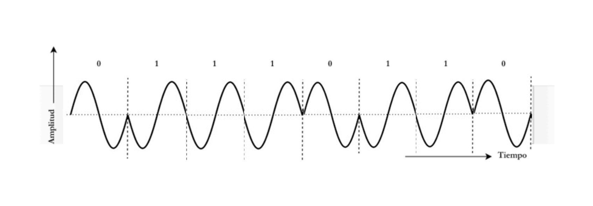
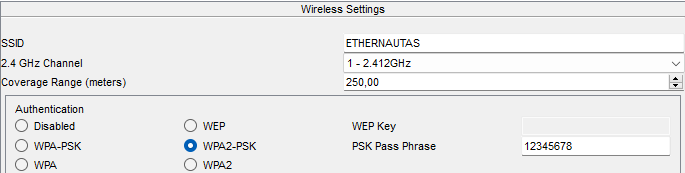
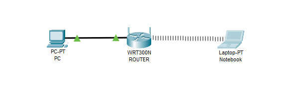
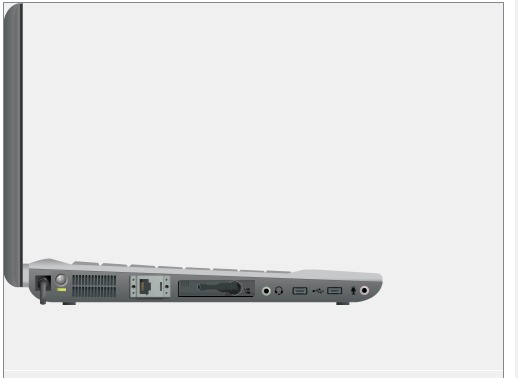
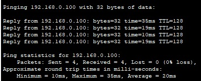
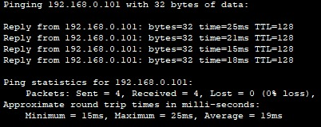
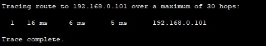
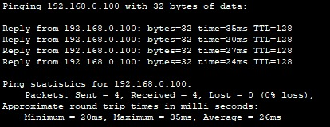
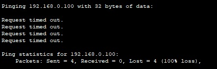

# Trabajo Práctico 1

**Nombres**  

_María Pilar Sabena_

_Mateo Quispe_

_Nicolas De la Mata_  

_Matias J. Costamagna_

**Grupo:** _Ethernautas_ 

**Facultad de Ciencias Exactas, Físicas y Naturales**  

**Asignatura:** _Comunicaciones de Datos_

**Profesores**
_Miguel Á. Solinas_
_Santiago M. Henn_
_Facundo Oliva Cuneo_

**Fecha:** _Agosto, 2025_

---

## Introducción

En este trabajo práctico se revisan conceptos básicos de ondas electromagnéticas, transmisión de datos y técnicas de modulación, para luego aplicarlos en una simulación con Packet Tracer. El objetivo es relacionar la teoría con un caso práctico de conectividad en una red simple, comprobando fenómenos como la atenuación de la señal y la verificación de conectividad entre dispositivos.

---

## Desarrollo

### Punto 1
#### Fundamentos de Señales y Ondas

Ondas Electromagnéticas: Son ondas que no requieren un medio material para propagarse, viajando a la velocidad de la luz. Están compuestas por campos eléctricos y magnéticos que oscilan de manera perpendicular entre sí y a la dirección de propagación. La luz, las ondas de radio y las microondas son ejemplos de estas ondas.

Modulación/Demodulación: La modulación es el proceso de codificar una señal de información (audio, video, datos) en una onda portadora, variando sus propiedades como la amplitud, la frecuencia o la fase. La demodulación es el proceso inverso, que recupera la señal de información original de la onda portadora en el extremo receptor.

Señales de Tiempo Continuo: Son señales que pueden asumir cualquier valor de amplitud en cualquier instante de tiempo. Se representan como una función continua, como las ondas de sonido o de radio.

Señales de Tiempo Discreto: Son señales muestreadas que solo existen en instantes de tiempo específicos. Se representan como una secuencia de valores, por ejemplo, los datos digitales que se transmiten en una red de computadoras.

a) El gráfico presenta una onda electromagnética con las siguientes características: 
Intensidad y Atenuación: El eje vertical (Intensidad) representa la amplitud de la onda. La línea roja punteada muestra la atenuación, que es la pérdida de intensidad a medida que la onda se propaga por la distancia.

Longitud de Onda: El eje horizontal (Distancia) permite determinar la longitud de onda (λ), que es la distancia de un ciclo completo de la onda. Teniendo en cuenta los puntos de 60 mm y 120 mm, la longitud de onda es de 60 mm.

En resumen, el gráfico ilustra una onda electromagnética que pierde intensidad a medida que se propaga y tiene una longitud de onda definida.

     
    
b) Para obtener el valor de la frecuencia, utilizamos la fórmula que relaciona la velocidad a la que viaja una onda con la longitud de dicha onda.
La longitud de onda $\lambda$ es la distancia que recorre la onda hasta completar un ciclo, lo que en la imagen se indica como 60 [mm] 
(o $60x10^{-3}$ [m]).

$f [Hz] = \frac{c}{\lambda} = \frac{3x10^8 [m/s]}{60x10^{-3} [m]} = 5x10^9 [Hz] = 5 [GHz]$

c) La onda del punto _a_, tiene una frecuencia de 5 [GHz], por lo que la banda correspondiente que incluye esta frecuencia es la banda Banda de Frecuencia Super Alta (Super High Frequency o SHF), que abarca frecuencias entre 3 [GHz] y 30 [GHz] [1].

d) Dispositivos que usan ondas en esta banda de frecuencias, son los aquellos que trabajan con redes WLAN, distintas comunicaciones satelitales, Internet, etc., como por ejemplo, Access point de tecnología 5G o Wi-Fi 6, que operan en bandas de microondas como 5 [GHz].

e) La línea de trazos representa la disminución de la intensidad de la onda conforme se propaga en el medio. Este fenómeno se conoce como atenuación, y ocurre porque al aumentar el área sobre la que se distribuye la potencia, disminuye la intensidad recibida. Esto tiene sentido ya que la intensidad es una propiedad de la onda que representa la cantidad de energía que esta transporta por unidad de tiempo y área, según la siguiente relación: 
$I [W/m^2]= \frac{Energía \cdot Tiempo}{Área} = \frac {Potencia}{Área}$

Por lo tanto, a medida que aumenta la distancia que recorrió la onda, la intensidad cae.

f) En el ejemplo del router inalámbrico, el fenómeno se puede apreciar claramente, ya que la intensidad de la señal se ve afectada cuando hay una mayor distancia y/o la señal debe atravesar paredes para llegar desde el router inalámbrico hasta el dispositivo final.

g) 
- i) La transmisión de telefonía celular se realiza mediante ondas electromagnéticas en el espectro de radiofrecuencia (usualmente entre 700 [MHz] y 3.5 [GHz]). Estas ondas se propagan por el aire y sufren atenuación por distancia (la potencia disminuye con el cuadrado de la distancia, como se explicó en el Punto 1), obstáculos (paredes, árboles, edificios generan pérdidas por absorción, reflexión y difracción), interferencia (otras señales en el mismo espectro pueden degradar la calidad). Un ejemplo típico es la pérdida de señal en sótanos o zonas rurales.
- ii) Por otro lado, el cable coaxial transmite señales eléctricas a través de un conductor metálico. La atenuación aquí ocurre por resistencia eléctrica del conductor, pérdidas dieléctricas en el aislante interno y dispersión (las frecuencias altas se atenúan más que las bajas). Aunque no hay propagación libre como en el aire, la señal se degrada con la longitud del cable.
- iii) En el caso la fibra óptica, la información se transmite por medio de impulsos de luz (onda electromagnética en el espectro óptico) por reflexión interna en un núcleo de vidrio o plástico. La atenuación se da por absorción del material, disperción de Rayleigh (afecta más a longitudes de ondas cortas) y pérdidas por empalmes o conectores. Aunque es muy eficiente, sigue habiendo pérdida acumulativa en largas distancias.

---

### Punto 2

a) La representación muestra un esquema de una transmisión seria síncrona del tipo Half Duplex. La transmisión es Half Duplex porque los módulos comparten el canal pero no pueden transmitir simultáneamente. Esto implica que deben alternar entre enviar y recibir, lo cual limita la velocidad efectiva.

b) No, el paradigma que permite transmitir datos a mayor velocidad es la transmisión paralela. La transmisión paralela permite enviar múltiples bits simultáneamente, lo que incrementa el ancho de banda. Sin embargo, requiere sincronización precisa y más líneas físicas, por lo que no siempre es viable.

c) La letra a transimitir sería la _e_ y su señal tendría la forma del siguiente diagrama:

d) Lo más apropiado es medir la señal en los instantes temporales correspondientes a flancos descendentes del clock, ya que allí la señal permanece constante, lo que reduce el riesgo de muestreo erróneo. En el caso del clock del diagrama, estos instantes corresponderian a los T0, T2, T4, etc.

---

### Punto 3

a) El gráfico corresponde a una modulación PSK. Esta es una tecnica de modulación digital que codifica información haciendo variar la fase de una onda portadora entre un numero limitado de valores discretos. En este caso, parece tratarse de BPSK, donde la fase cambia entre 0° y 180° para representar bits 0 y 1.

b)

c) Si hablamos de modulaciones de señales analógicas para datos digitales, otras técnicas similares, son la FSK, ASK, QAM y todas sus variantes dependiendo de la cantidad de símbolos distintos que se quieran transmitir [2].

d) El BER es un parámetro que indica que tan bueno es el desempeño de un sistema de comunicación determinado. Fundamentalmente indica la probabilidad de error por bit transmitido.
La técnica de modulación con mejores prestaciones es la PSK, la comparación entre las técnicas y sus eficiencias se encuentra desarrollada en el libro [2]. PSK tiene buen desempeño en canales con ruido moderado, pero técnicas como QAM pueden ser más eficientes en términos de tasa de bits por símbolo, aunque más sensibles al ruido.

---

### Punto 4

b) Configuracion del Router:

c) La frecuencia a la que opera el router es 2.412 [GHz], la cual está incluida en la banda de Frecuencias Ultra Altas (Ultra High Frequency o UHF) que abarca desde los 300 [MHz] hasta los 3 [GHz]

d) Conexion computadora-router:

e)Laptop con placa Wi-Fi WPC300N:

g) Para comprobar la conectividad entre las computadoras se utilizaran los comandos _ping_ y _tracert_. 

El _ping_ envía paquetes al destino y espera la respuesta de este último. Sirve para comprobar si un dispositivo responde y está accesible en la red.

El _tracrt_ envía paquetes al destino con un TTL (Time To Live) que va aumentando en cada intento. Cada dispositivo por el que pasa el paquete reduce ese TTL y responde cuando llega a 0. Esto permite descubrir la ruta (los saltos intermedios) que siguen los paquetes hasta llegar al destino.

***

**Pruebas**

IP PC: 192.168.0.100 

IP Notebook: 192.168.0.101

Gateway: 192.168.0.1

_Prueba 1_

Desde la Notebook se utiliza ping a la IP de la PC: 

ping 192.168.0.100

***

_Prueba 2_

Desde la PC se utiliza ping a la IP de la Notebook: 

ping 192.168.0.101

***

_Prueba 3_

Trace Route desde la PC a la Notebook: 

tracert 192.168.0.101

La razón por la cual no aparece el router en la ruta de destino, es porque ambas computadoras estan dentro de una red   LAN, por lo que no es necesario pasar por el router para llegar al otro equipo.

h)

IP Notebook externa: 192.168.0.102

Gateway: 192.168.0.1

_Prueba: Notebook externa dentro del rango de la señal_

Desde la Notebook externa se utiliza ping a la IP de la PC dentro de la oficina: 

ping 192.168.0.100

_Prueba: Notebook externa feura del rango de la señal_

Desde la Notebook externa se utiliza ping a la IP de la PC dentro de la oficina: 

ping 192.168.0.102

*** 

**Conclusiones**

Comparando los tiempos de viaje de los paquetes para el caso de la notebook dentro de la oficina y la notebook fuera de ella, podemos observar que su valor aumenta considerablemente lo que resulta en una conexión "lenta". Por otro lado, si nos alejamos demasiado del router como es el caso de la 2da prueba del inciso 4-h, ya no tenemos recepción de los paquetes debido a que estamos fuera del rango de la red que genera el router.
Esto nos permite comprobar por medio de una simulación, el fenómeno que hablamos en el punto 1, sobre la atenuacion de la señal a medida que nos alejamos del origen de la misma.

--- 

## Referencias

[1] Radio spectrum, https://en.wikipedia.org/wiki/Radio_spectrum \
[2] Comunicaciones y Redes de Computadoras, Stallings, 7ma Edición, PEARSON EDUCACIÓN, S. A., Madrid, 2004