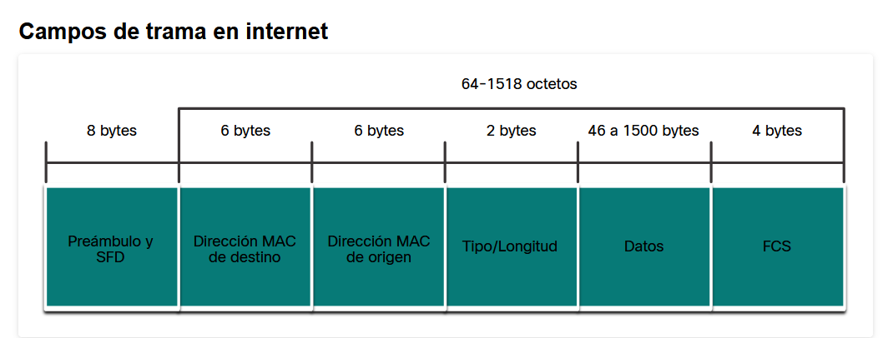

# Trabajo Práctico 2

**Nombres**  

_María Pilar Sabena_

_Mateo Quispe_

_Nicolas De la Mata_  

_Matias J. Costamagna_

**Grupo:** _Ethernautas_ 

**Facultad de Ciencias Exactas, Físicas y Naturales**  

**Asignatura:** _Comunicaciones de Datos_

**Profesores**
_Miguel Á. Solinas_
_Santiago M. Henn_
_Facundo Oliva Cuneo_

**Fecha:** _Septiembre_, 2025_

---

### Introducción

---

### Desarrollo

- 1
    - a) La figura representa el efecto Doppler, el cual consta de un cambio en la frecuencia de una señal producido por el movimiento relativo de su emisor con respescto a su receptor. Cuando se acercan, la frecuencia aumenta, y cuando se alejan, la frecuencia disminuye.
    El movimiento relativo "aprieta" las ondas al acercarse la fuente, acortando su longitud y aumentando la frecuencia; al alejarse, las "estira", alargando la longitud y disminuyendo la frecuencia.

    - b) El efecto Doppler afecta mas a las Bandas altas (30 MHz hasta 300 GHz) ya que el corrimiento es proporcional a la frecuencia. Mientras que las mas resilientes son las Bandas Bajas (30 kHz a 30 MHz) el corrimiento Doppler es despreciable.

    - c) La razón se fundamenta en que el celular puede generar interferencias con el sistema de comunicación o navegación del avión

- 2
    - a) El fenómeno físico que representa la figura es el ruido en una señal electromagnética. Este fenómeno es intrínseco a cualquier sistema de comunicación y tienen las siguientes caracteristicas principales:

        -   Es un fenómeno aleatorio: Su magnitud y comportamiento no son predecibles.
        -   Genera distorsión y pérdida de información, ya que modifica la amplitud, fase o frecuencia de la onda.
        -   Su magnitud se mide en relación a la señal útil: La importancia del ruido no radica en su valor absoluto, sino en su relación con la potencia de la señal original. Esta relación se conoce como SNR (Signal-to-Noise Ratio).

    - b) El ruido afecta de forma distinta según la banda de transmisión. En las bandas altas (como Wi-Fi en 5 GHz o microondas) la señal pierde más energía con la distancia y cualquier interferencia la degrada rápido, por lo que el ruido genera más errores y menor alcance. En las bandas bajas (como 2,4 GHz o radio VHF) el efecto del ruido es menor: la señal viaja más lejos y atraviesa mejor los obstáculos, aunque con menos capacidad de datos. En cambio, la fibra óptica no se ve afectada por este tipo de ruido porque transmite con luz en lugar de impulsos eléctricos.

    - c)  SNR es la relación entre la potencia de la señal y la potencia del ruido. Generalmente, se expresa en decibelios (dB) para manejar rangos de valores muy amplios. Un SNR alto indica que la potencia de la señal es significativamente mayor que la del ruido, lo que se traduce en una mejor calidad de transmisión.
    La fórmula para calcular el SNR es la siguiente:

        $$SNR = \frac{P_{señal}}{P_{ruido}} $$
    
        El BER (Bit Error Rate), o tasa de error de bits, es la proporción de bits incorrectamente recibidos en relación con el total de bits transmitidos. La relación entre el BER y el SNR es inversa: a mayor SNR, menor es el BER.

- 3
    - a) Ethernet es una tecnología de red de área local (LAN) que utiliza comunicaciones por cable (par trenzado, fibra óptica, cables coaxiales) y opera en las capas de enlace de datos y física del modelo OSI. Se define por los estándares IEEE 802.2 y 802.3.  
    Este se caracteriza por su evolución de un sistema de medio compartido con topología de bus a las redes modernas que usan switches para una comunicación dúplex completo, eliminando la necesidad de CSMA/CD para evitar colisiones. Una de sus principales características es su capacidad para adaptarse a una amplia gama de velocidades de transmisión, que van desde 10 Mbps hasta 100 Gbps.\
    Por otro lado, la estructura de una trama de datos en Ethernet está definida por el estándar IEEE 802.3. Esta encapsulación incluye las direcciones MAC de origen y de destino para garantizar que la trama se entregue correctamente dentro de la misma red de área local (LAN). Como se muestra en la imagen, estos campos tienen un tamaño de 6 bytes cada uno. Para asegurar la integridad de los datos, la trama también utiliza una Secuencia de Verificación de Trama (FCS), que tiene un tamaño de 4 bytes y se encarga de la detección de errores durante la transmisión. La imagen también ilustra otros campos importantes como el Preámbulo y SFD (8 bytes), el campo Tipo/Longitud (2 bytes) y el campo de Datos (46 a 1500 bytes), mostrando cómo todos ellos se combinan para formar una trama completa.
    

  
    Las diferencias de velocidad entre las tecnologías Ethernet se basan en los siguientes anchos de banda soportados:

        - 10 Mbps (Ethernet original)

        - 100 Mbps (Fast Ethernet)

        - 1000 Mbps (Gigabit Ethernet)

        - 10,000 Mbps (10 Gigabit Ethernet)

        - 40,000 Mbps (40 Gigabit Ethernet)

        - 100,000 Mbps (100 Gigabit Ethernet)

    - b) El cableado de par trenzado no blindado (UTP) es el medio de red más común. El cableado UTP, que se termina con conectores RJ-45, se utiliza para interconectar hosts de red con dispositivos intermediarios de red, como switches y routers. Los cables UTP no utilizan blindaje para contrarrestar los efectos de la EMI y la RFI. En cambio, los diseñadores de cable han descubierto otras formas de limitar el efecto negativo del crosstalk:

        - Anulación - Los diseñadores ahora emparejan los hilos en un circuito. Cuando dos hilos en un circuito eléctrico están cerca, los campos magnéticos son exactamente opuestos entre sí. Por lo tanto, los dos campos magnéticos se anulan y también anulan cualquier señal de EMI y RFI externa.
        - Variando el número de vueltas por par de hilos - Para mejorar aún más el efecto de anulación de los pares de hilos del circuito, los diseñadores cambian el número de vueltas de cada par de hilos en un cable. Los cables UTP deben seguir especificaciones precisas que rigen cuántas vueltas o trenzas se permiten por metro (3,28 ft) de cable. Observe en la figura que el par naranja y naranja/blanco está menos trenzado que el par azul y azul/blanco. Cada par coloreado se trenza una cantidad de veces distinta.
        - Los cables UTP dependen exclusivamente del efecto de anulación producido por los pares de hilos trenzados para limitar la degradación de la señal y proporcionar un autoblindaje eficaz de los pares de hilos en los medios de red.
        
        La diferencia radica en la disposición de los hilos en los conectores RJ45 en cada extremo:

        - Cable derecho (straight-through): Los pines en ambos extremos del cable están en el mismo orden. Se usa para conectar dispositivos de diferente tipo (por ejemplo, una computadora a un switch).

        - Cable cruzado (crossover): Los pares de hilos de transmisión y recepción están cruzados en uno de los extremos. Se usa para conectar dispositivos del mismo tipo (por ejemplo, una computadora a otra computadora o un switch a otro switch) sin necesidad de un dispositivo intermedio.

    - c) Paquete recibido:
        - 0000   18 c0 4d 95 0d 34 ec be dd af 02 c4 08 00 45 00
0010   00 3c 9c 19 00 00 40 01 5d 33 c0 a8 00 01 c0 a8
0020   00 23 00 00 55 4f 00 01 00 0c 61 62 63 64 65 66
0030   67 68 69 6a 6b 6c 6d 6e 6f 70 71 72 73 74 75 76
0040   77 61 62 63 64 65 66 67 68 69

    - d)

    - e) Paquete recibido:
        - 0000   18 c0 4d 95 0d 34 ec be dd af 02 c4 08 00 45 00
0010   00 3c bd 22 00 00 3b 01 9b b9 b5 6e b0 ab c0 a8
0020   00 23 00 00 55 45 00 01 00 16 61 62 63 64 65 66
0030   67 68 69 6a 6b 6c 6d 6e 6f 70 71 72 73 74 75 76
0040   77 61 62 63 64 65 66 67 68 69
        - MAC addres:

        

- 4

A partir de las pruebas realizadas con Wireshark y el análisis de paquetes en la red, se pueden extraer las siguientes conclusiones:

    - Privacidad en la red

    Cada dispositivo conectado a una red deja rastros identificables en el tráfico que genera. La dirección IP identifica la ubicación lógica en la red, mientras que la dirección MAC actúa como identificador único del hardware de red.
    Esto significa que, aunque cambiemos de IP (dinámica o manualmente), la MAC sigue siendo la misma y permite reconocer al dispositivo en el nivel de enlace de datos. Por lo tanto, la privacidad en la red está limitada: un administrador o cualquier software de monitoreo como Wireshark puede identificar qué dispositivo envió o recibió un paquete.

    - Trazabilidad de una dirección MAC

    Las MAC no solo permiten diferenciar dispositivos dentro de una red local, sino que también contienen información sobre el fabricante de la tarjeta de red en sus primeros 3 octetos (OUI – Organizationally Unique Identifier). Gracias a esto, es posible saber la marca del dispositivo, lo que aumenta la trazabilidad y reduce el anonimato en entornos de red cerrados.
    En consecuencia, aunque una dirección MAC no se comparte directamente en internet (solo en la red local), dentro de una LAN puede servir como un dato sensible de identificación.

    - Comparación con el IMEI

    El IMEI (International Mobile Equipment Identity) es un identificador único de los dispositivos móviles (celulares, tablets con SIM, etc.). Al igual que la MAC, el IMEI está asociado al hardware y permite identificar de manera global al dispositivo en redes móviles. Ambos son números únicos asignados por el fabricante y difíciles de modificar, lo que asegura la trazabilidad del equipo.
    Diferencia clave: la MAC se utiliza en redes locales (LAN/WiFi), mientras que el IMEI se emplea en redes móviles (2G/3G/4G/5G).

    - ¿Una VPN oculta la dirección MAC?

    Una VPN (Virtual Private Network) oculta la dirección IP pública del usuario, ya que enmascara el tráfico enviándolo a través de un servidor intermediario. Sin embargo, la dirección MAC no se oculta con una VPN, porque esta solo es visible dentro de la red local.
    Por lo tanto, la VPN mejora la privacidad en el nivel de red (IP), pero no en el nivel de enlace de datos (MAC).

    - Conclusión general

    El análisis realizado muestra que tanto la dirección MAC como el IMEI son identificadores únicos que comprometen la privacidad al permitir rastrear dispositivos de manera persistente. Herramientas como Wireshark facilitan evidenciar esta trazabilidad. Aunque las VPNs ayudan a ocultar la IP en internet, la dirección MAC continúa siendo visible dentro de la red local, por lo que la privacidad nunca es absoluta.

    