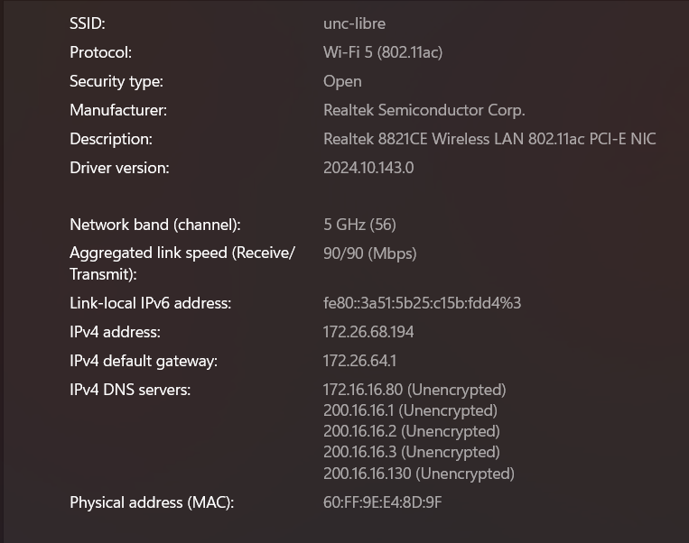
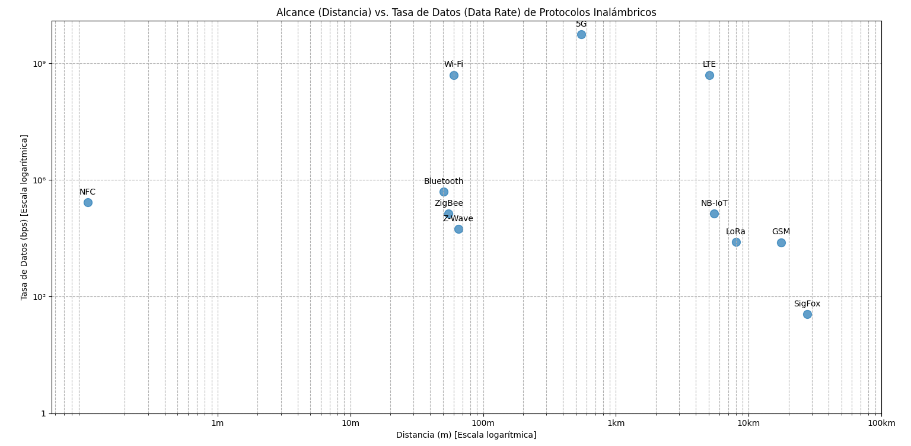

# Trabajo Práctico 3

**Nombres**  

_María Pilar Sabena_

_Mateo Quispe_

_Nicolas De la Mata_  

_Matias J. Costamagna_

**Grupo:** _Ethernautas_ 

**Facultad de Ciencias Exactas, Físicas y Naturales**  

**Asignatura:** _Comunicaciones de Datos_

**Profesores**
_Miguel Á. Solinas_
_Santiago M. Henn_
_Facundo Oliva Cuneo_

**Fecha:** _Septiembre_, 2025_

---

## Desarrollo

### Punto 1

a) Historia y campo de aplicación de los estándares IEEE 802.3 y 802.11

El estándar IEEE 802.3, conocido comúnmente como Ethernet, fue publicado en 1983 con el objetivo de definir las especificaciones de la capa física y de la subcapa de control de acceso al medio (MAC) para redes de área local cableadas. A lo largo de los años ha evolucionado desde las primeras versiones que ofrecían 10 Mbps de velocidad hasta las implementaciones actuales que superan los 400 Gbps, siendo la base de la gran mayoría de las redes LAN en el mundo. Su campo de aplicación principal es la transmisión de datos mediante cableado (UTP, STP o fibra óptica), garantizando alta velocidad, estabilidad y baja latencia.

Por otro lado, el estándar IEEE 802.11, publicado en 1997, corresponde a las redes de área local inalámbricas, conocidas como Wi-Fi. Este estándar define también la capa física y la subcapa MAC, pero orientadas a la transmisión por medios inalámbricos utilizando radiofrecuencia. Desde su primera versión, con velocidades modestas (2 Mbps), ha ido evolucionando en distintas versiones como 802.11a/b/g/n/ac/ax hasta la más reciente 802.11be, alcanzando velocidades del orden de los gigabits por segundo. Su campo de aplicación se centra en las redes WLAN, brindando movilidad, facilidad de despliegue y conectividad en entornos donde no es posible o no resulta conveniente el uso de cableado físico.
    
b) Para poder determinar el protocolo usado por las redes abiertas disponibles en la Facultado, nos conectamos a la red unc-libre. Dentro de su configuracion, pudimos obtener la informacion de que el protocolo que utiliza es el 802.11ac. El protocolo 802.11ac, también conocido como Wi-Fi 5, es un estándar de redes inalámbricas definido por el IEEE para mejorar la velocidad de transmisión de datos en la banda de 5 GHz.
Para obtener este dato, utilizamos las configuraciones de WiFi de Windows de la computadora de uno de los integrantes del grupo, alli obtuvimos la siguiente informacion:

c) Cuando una red Wi-Fi opera con un determinado protocolo (por ejemplo, 802.11ax – Wi-Fi 6) y un dispositivo posee una placa de red inalámbrica (NIC) más antigua que no soporta dicho protocolo, pueden ocurrir dos situaciones:

- Compatibilidad descendente (backward compatibility): en la mayoría de los casos, los puntos de acceso Wi-Fi son retrocompatibles. Esto significa que el dispositivo podrá conectarse, pero utilizando la versión más antigua que ambos soporten. Por ejemplo, si la red está en Wi-Fi 6 y la notebook solo soporta Wi-Fi 4 (802.11n), la conexión se establecerá bajo 802.11n, con menor velocidad y eficiencia.

- Incompatibilidad total: si el punto de acceso no admite protocolos anteriores o la NIC es demasiado antigua para reconocer el estándar, la conexión no será posible. Esto puede ocurrir con equipos muy viejos frente a protocolos modernos.

Seria normal esperar que la red se degrade a la versión común más baja soportada, afectando el rendimiento, la seguridad y la experiencia de usuario, pero manteniendo la conectividad.
    
e) 

| Característica        | Wi-Fi 5              | Wi-Fi 6              | Wi-Fi 7               |
|------------------------|----------------------|----------------------|-----------------------|
| Versión IEEE           | 802.11ac             | 802.11ax             | 802.11be              |
| Tasa de datos máxima   | ~6,9 Gbps            | ~9,6 Gbps            | ~46 Gbps              |
| Bandas                 | 5 GHz                | 2,4 / 5 / 6 GHz      | 2,4 / 5 / 6 GHz       |
| Ancho de banda         | 20 – 160 MHz         | 20 – 160 MHz         | hasta 320 MHz         |
| Modulación             | 256-QAM              | 1024-QAM             | 4096-QAM              |
| Sistema de Seguridad   | WPA2                 | WPA3                 | WPA3      |
  
---

### Punto 2

a)
1. Fibra Monomodo (izquierda)
    - La luz viaja en un único camino recto por el núcleo.  
    - Núcleo muy delgado ($\approx 8–10 \mu m$).  
    - Permite grandes distancias (decenas o cientos de km) con baja atenuación.  
    - Gran ancho de banda y velocidad de transmisión.  
    - Más costosa de implementar (requiere láseres precisos y conectores delicados).

2. Fibra Multimodo (derecha)
    - La luz se propaga en múltiples trayectorias (rebotes en el núcleo).  
    - Núcleo más ancho ($\approx 50 – 62,5 \mu m$).  
    - Más económica y sencilla de instalar (usa LEDs como fuente de luz).  
    - Adecuada para distancias cortas (hasta algunos km).  
    - Presenta dispersión modal que limita velocidad y alcance.

b) La Ley de Snell establece la relación entre los ángulos de incidencia y refracción de un rayo de luz cuando pasa de un medio a otro con distinto índice de refracción. Su expresión matemática es:

$n_1 \cdot \sin(\theta _1) = n_2 \cdot \sin(\theta _2)$

donde:

$n_1$ y $n_2$ son los índices de refracción de los medios,  
$\theta _1$ es el ángulo de incidencia,  
$\theta _2$ es el ángulo de refracción.  

En el caso de la fibra óptica, esta ley explica el fenómeno de la reflexión interna total, que ocurre cuando la luz pasa del núcleo (con mayor índice de refracción) al revestimiento (con menor índice de refracción) en un ángulo mayor al ángulo crítico. Esto asegura que la señal se mantenga confinada dentro del núcleo y se propague a lo largo de la fibra.  

La relación con los modos de transmisión es la siguiente:  
- En fibra monomodo, el núcleo es muy pequeño y solo se permite un camino de propagación, minimizando la dispersión.  
- En fibra multimodo, el núcleo es mayor y la luz puede reflejarse en múltiples trayectorias, lo que genera dispersión modal y limita la distancia máxima de transmisión.  

--- 

### Punto 3

a)
| Protocolo | ¿Está estandarizado? Si/No | Si aplica: ¿Cuál(es) estándares? (si tiene varios mencionar la última versión) |
|-----------|----------------------------|--------------------------------------------------------------------------------|
| Wi-Fi     | Sí                         | IEEE 802.11 (última versión: 802.11ax – Wi-Fi 6/6E, en desarrollo 802.11be – Wi-Fi 7) |
| Bluetooth | Sí                         | IEEE 802.15.1 / Bluetooth SIG (última versión: Bluetooth 5.4, 2023)            |
| ZigBee    | Sí                         | IEEE 802.15.4 + ZigBee Alliance (última versión: ZigBee 3.0)                   |
| NFC       | Sí                         | ISO/IEC 18092, 21481, ECMA-340 (última versión soportada: NFC Forum standards) |
| LTE       | Sí                         | 3GPP Release 8 en adelante (última evolución: LTE-Advanced Pro, Rel. 13–15)    |
| GSM       | Sí                         | 3GPP Release (Rel. 99 y sucesivas, aunque en desuso)                           |
| 5G (3GPP) | Sí                         | 3GPP Release 15, 16, 17 (última versión: Rel. 17 aprobada en 2022, avanzando a Rel. 18) |
| LoRa      | Parcialmente               | LoRa propietario (Semtech) + LoRaWAN estandarizado por LoRa Alliance (última versión: LoRaWAN 1.0.4 / 1.1) |
| NB-IoT    | Sí                         | 3GPP Release 13 (parte de LTE evolutivo)                                       |
| SigFox    | No (propietario)           | Tecnología propietaria de SigFox                                               |
| Z-Wave    | Sí (recientemente)         | Z-Wave Alliance, desde 2020 estándar ITU-T G.9959                               |

El 3GPP (3rd Generation Partnership Project) es el organismo que define los estándares de telecomunicaciones móviles (2G, 3G, 4G, 5G y ahora 6G).

b) 

c)
| Característica                  | UTP                           | Fibra Óptica                         | Wi-Fi 802.11be (Wi-Fi 7)                 | Bluetooth 5.4                 | 5G                                |
|---------------------------------|-------------------------------|--------------------------------------|------------------------------------------|--------------------------------|-----------------------------------|
| Ancho de banda              | Hasta 10 Gbps (Cat 6a/7)      | >100 Gbps                            | Hasta 46 Gbps teóricos                   | ~2 Mbps (BLE), hasta 24 Mbps EDR | Hasta 10 Gbps (teórico)           |
| Distancias                  | 100 m máx.                   | Varios km (hasta 40 km o más)        | 30–100 m                                | 1–100 m                        | 1–10 km (dependiendo del despliegue) |
| Inmunidad a EMI / RFI       | Baja (susceptible a interfer.)| Muy alta (no conductor eléctrico)    | Media (afectado por interferencias)      | Media-baja (interferencias 2.4 GHz) | Media (afectado por condiciones del espectro) |
| Costos de medios/conectores/dispositivos | Bajo                          | Alto                                 | Medio                                   | Muy bajo                       | Alto (infraestructura y equipos)   |
| ¿Disponible en Packet Tracer? | Sí                           | No                                   | Sí                                      | No                             | No                                |

---
### Punto 4

El estado del arte en Comunicaciones de Datos es la recopilación y análisis de las tecnologías más recientes y avanzadas que permiten la transmisión de información digital, abarcando desde protocolos de red y arquitecturas, hasta infraestructuras físicas (fibra, satélite, 5G/6G, IoT, etc.), evaluando su nivel de madurez, limitaciones y tendencias futuras.

a) La conectividad a internet en los aviones se logra principalmente mediante dos tecnologías principales: la conexión vía satélite y la conexión aire-tierra (ATG). 

La tecnología de satélite utiliza antenas en la parte superior que se conectan a una red de satélites en órbita, que a su vez se enlazan con estaciones terrestres para acceder a Internet. Este sistema permite una cobertura global y es especialmente útil para vuelos sobre grandes extensiones de agua donde no hay cobertura terrestre. 

Por otro lado, la tecnología aire-tierra (ATG) utiliza antenas en la parte inferior del avión que se conectan a torres de telefonía móvil en tierra, permitiendo acceso a Internet mientras el avión está sobre tierra firme.
Aunque esta opción es menos costosa para las aerolíneas, su cobertura está limitada a zonas con infraestructura terrestre.
La calidad de la señal puede verse afectada al sobrevolar grandes extensiones de agua, debido a la reflexión de las ondas de radiofrecuencia y al aumento de la distancia a la estación terrestre.

b) [Adaptive Beam Steering for Next-Generation Ku-Band Antennas on Commercial Aircraft](https://pmc.ncbi.nlm.nih.gov/articles/PMC11435494/)

Este artículo investiga una nueva técnica para mejorar la estabilidad de la conexión a internet en aviones que usan la banda Ku. La investigación propone un algoritmo para que la antena de la aeronave ajuste automáticamente la dirección de su haz, siguiendo al satélite incluso cuando el avión se mueve. 

c) 
El contenido como películas, series o música se almacena en un servidor de red local a bordo del avión. Este servidor está conectado a la red Wi-Fi del avión, a la que se conectan los dispositivos de los pasajeros. 

Cuando un pasajero decide ver una película, su dispositivo envía una solicitud al servidor local. El servidor responde transmitiendo el contenido de la película a través de la red Wi-Fi interna. Este proceso no consume ancho de banda satelital porque el tráfico no sale del avión.

El tráfico de internet, como enviar un correo electrónico o navegar por la web, requiere una conexión externa. Esta conexión se establece a través de una antena en el exterior del avión que se comunica con una red de satélites. A su vez, los satélites se conectan a estaciones terrestres que dirigen el tráfico a internet.

Cuando un pasajero quiere enviar un correo, su dispositivo envía la solicitud a través de la red Wi-Fi del avión, que luego se redirige a través de la antena satelital. Este proceso sí consume ancho de banda satelital, el cual es limitado y costoso.

El sistema de gestión de la red del avión está diseñado para diferenciar y priorizar el tráfico.

El tráfico de entretenimiento a bordo se identifica como tráfico local y se maneja dentro de la red del avión, sin pasar por la conexión satelital. Esto garantiza que las películas y series se carguen rápidamente y con buena calidad, ya que no dependen de la velocidad del internet.

El tráfico de internet se identifica y se dirige hacia la antena satelital. Para optimizar el uso del ancho de banda, se pueden aplicar reglas que den prioridad a ciertos tipos de datos (como correos o mensajes de texto) sobre otros.